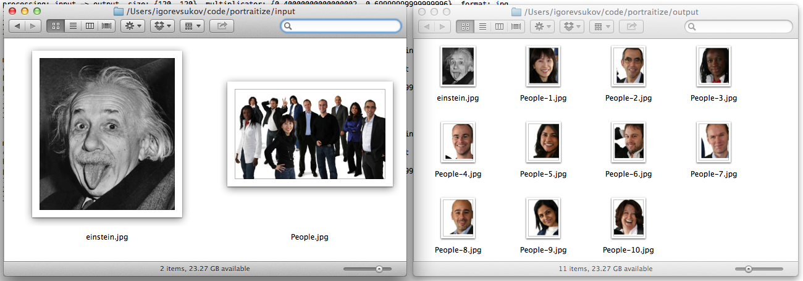

# `portraitize` - OS X tool to extract portrait photos

Powered by `CIFaceFeature` from `CoreImage.framework`, this tool will batch scan input directory for images with faces and then extract those into output directory with specified image resolution.



## Usage

```bash
./portraitize -i <input-dir> -o <output-dir>
```

For every image in `<input-dir>` `portraitize` will scan for faces, if present – it will extract that part of an image, crop/resize and save with the same filename.

Additional parameters:

* `-s --size [120x120]` - maximum output image size. Cropped face will be scaled to fit this size
* `-m --multiplicator [40x70]` – how the recognized face rect should be increased by the % of the width/height
* `-v --version` – print version
* `-h --help` – print help
* `-f --format` - output file format. Possible options are `tiff`, `bmp`, `gif`, `png`, `jpeg` (or `jpg`). Default - `jpeg`

## Todo

* publish as homebrew package [on separate homebrew repo](https://github.com/mxcl/homebrew/wiki/brew-tap)
* debug mode which will draw face rectangle on output photos

## Issues

* algorithm for resizing output image needs to improved

## Compilaion

Make sure that you have `Command Line Tools` or `Xcode` installed

```bash
make
```

To debug, use

```base
make debug
```

You can put custom `lldb` commands into `.lldbinit` 
